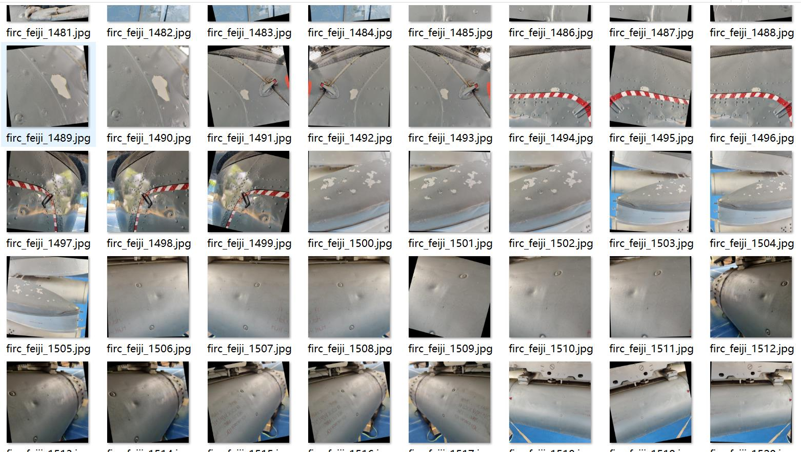
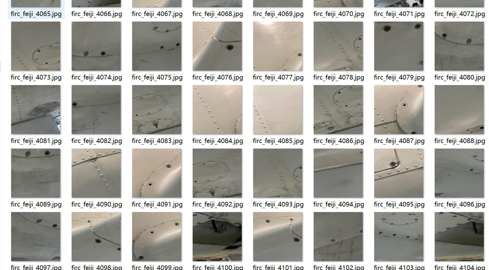
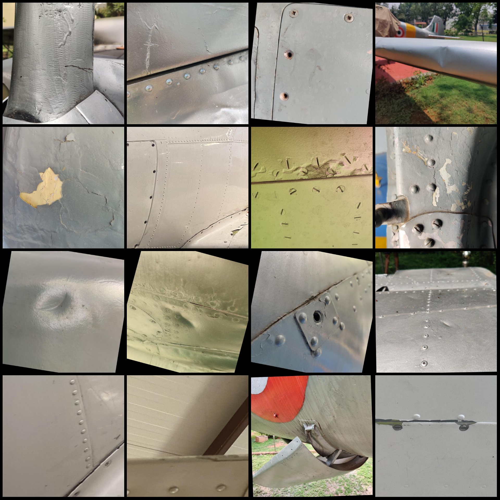
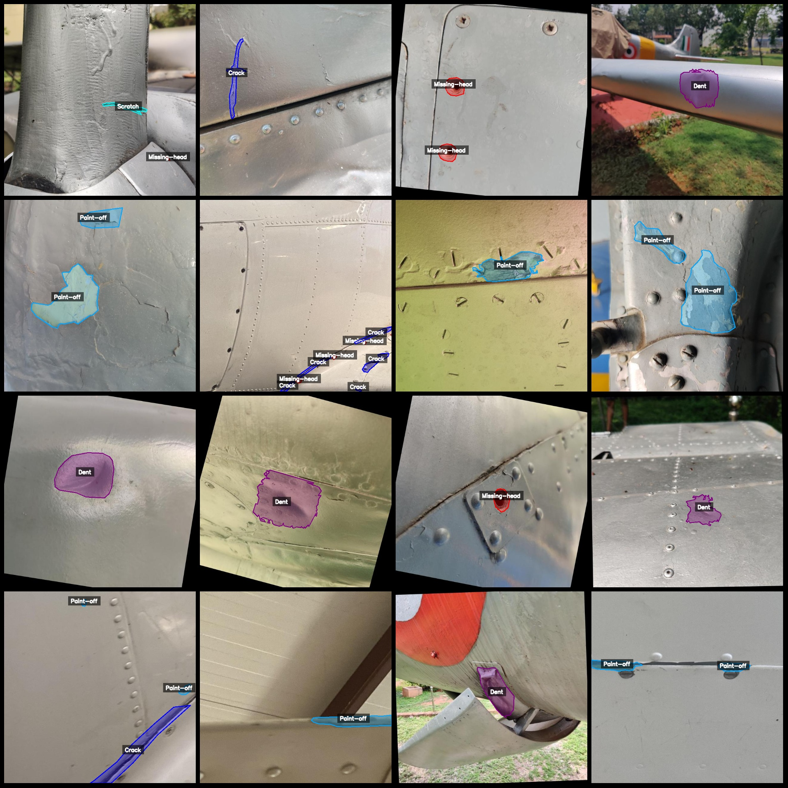
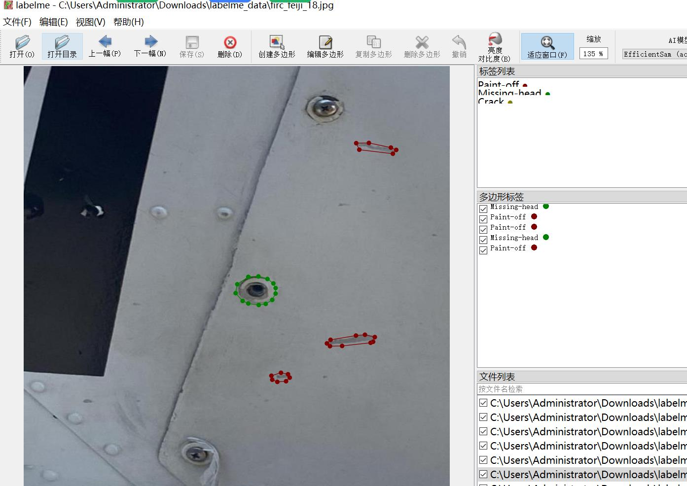

# Airplane Surface Defect Identification and Segmentation Dataset - LabelMe Format: 4612 Images, 5 Classes

Note: More than half of the images in the dataset are enhanced images.

Dataset format: LabelMe format (excluding mask files, only including JPG images and corresponding JSON files).

Number of images (JPG file count): 4612
Number of labels (JSON file count): 4612
Number of label categories: 5
Label categories: ["Crack", "Dent", "Missing-head", "Paint-off", "Scratch"]
Each category labeled boxes:
- Crack (Craze) count = 1526
- Dent (Dent) count = 1622
- Missing-head (Head missing) count = 2457
- Paint-off (Paint off) count = 2446
- Scratch (Scratch) count = 483
Total box count: 8534

Used labeling tool: labelme=5.5.0

Image resolution: 640x640

Labeling rule: Polygons are drawn around the categories.

Important note: The dataset can be opened and edited using LabelMe, but the JSON dataset needs to be converted into either a Mask or Yolo or COCO format for semantic segmentation or instance 
segmentation.

Special declaration: This dataset does not guarantee the accuracy of the trained model or weight files.

Preview of images:

Examples of annotations (select 16 images randomly):

Annotation drawing results:

LabelMe editing example image:

## Images

Here is a pay link on Stripe ( https://buy.stripe.com/3cs8yP7sY87d0vu9AB ). Please contact me lonlonago@foxmail.com after funding $89, and I will send you a complete data files , thank you!

